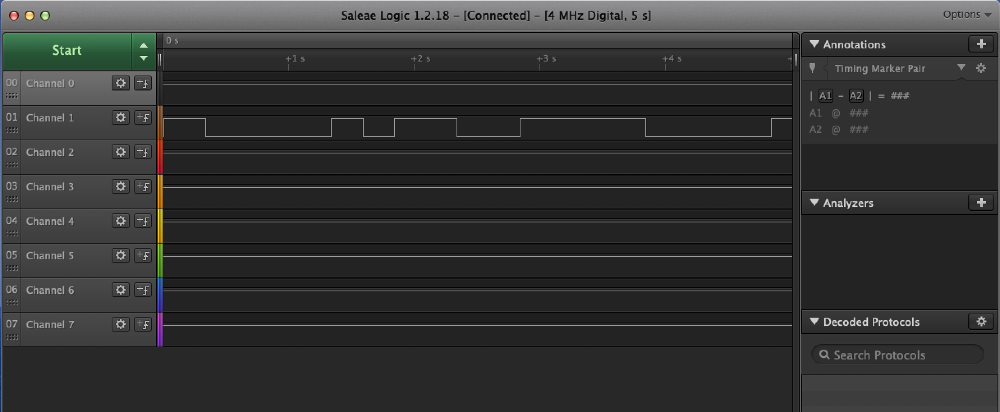
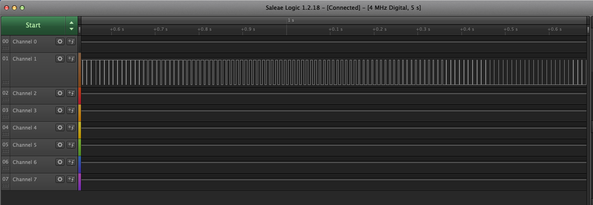
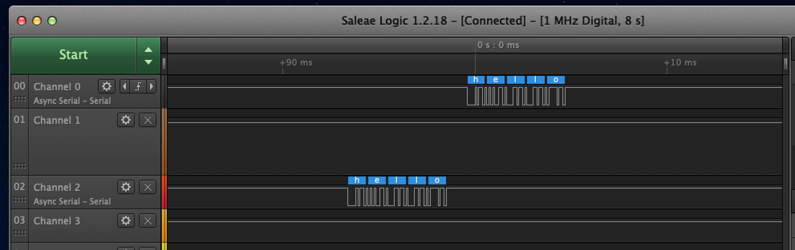
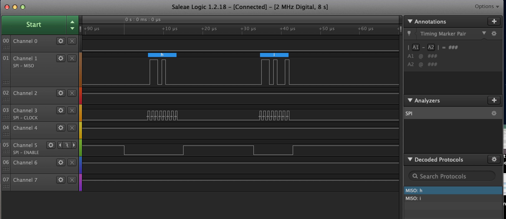

Name: Joseph Lawler

EID: jfl849

Team Number: F3

## Questions

1. Why does your program need a setup and a loop?

    Setup is where you intitialize your board layout meanwhile loop is where your functional code runs.

2. What is the downside to putting all your code in a loop?

    The board gets reinitialized everytime which is unnecessary.

3. Why does your code need to be compiled?

    Machine code and the code we write is different. You have compile your code so that the machine can understand what you wrote.

4. When lowering the frequency in procedure A, step 4, what is going wrong? Brainstorm some solutions. Dimmers exist in the real world. What is their solution?

    Lowering the frequency resulting in flickering. Increasing the frequency to something faster than the human eye can register will prevent one from seeing the flickering.
    Their solution is to increase the frequency and provide the light source with stable power.

5. Why do you need to connect the logic analyzer ground to the ESP32 ground?

    You need to close the circuit between the two to prevent a short.

6. What is the difference between synchronous and asynchronous communication?

    Synchronous communication needs a clock signal meanwhile asynchronous communication does not need a clock signal.

7. Profile of UART: Sent X bytes in Y time 

    Sent 5 bytes in 5.262ms.

8. Profile of SPI: Sent X bytes in Y time

    Sent 2 bytes in 36 microseconds.

9. Why is SPI so much faster than UART?

    SPI is faster because it refreshes on a clock meanwhile UART refreshes only when it receives/sends data.

10. list one pro and one con of UART

    Pro - simple to operate. Con - slow.

11. list one pro and one con of SPI

    Pro - fast. Con - more pins occupied.

12. list one pro and one con of I2C

    Pro - flexible and supports multi-master/slave communication. Con - slower speed and higher complexity.

13. Why does I2C need external resistors to work?

    The lines are open drain so they required pull up/down resistors.

## Screenshots

Procedure A, step 1:

Procedure A, step 4:

Procedure B, UART:

Procedure B, SPI:

